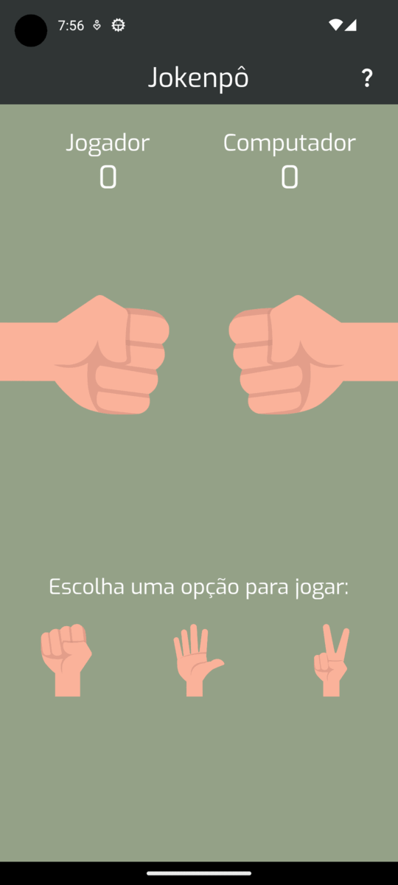
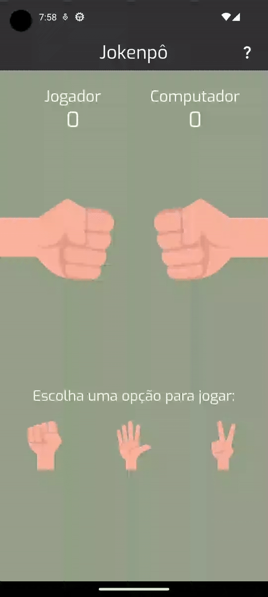

# Jokenpô - 1nd test of the discipline "Programação 4" at UESPI
[Download APK here](https://github.com/Weslley41/jokenpo/releases/download/v1/jokenpo.apk)

## Task
Develop a mobile application in Flutter that implements the Jokenpô game.

## Students:
- Gabriel Benigno Rocha 
- Weslley de Jesus Souza Morais

## Instructions
```
# Installing dependencies
flutter pub get

# Running the app
flutter run
```

## Technologies used
<div style="display: inline_block">
    
    
</div>

## Screenshots
<div style="display: flex; justify-content: space-around;">
    
    
</div>
